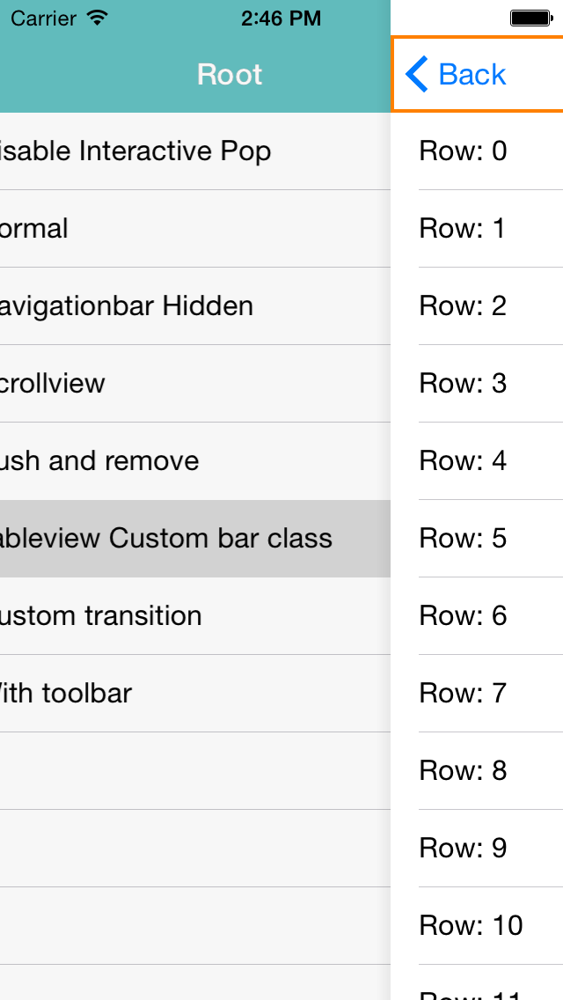
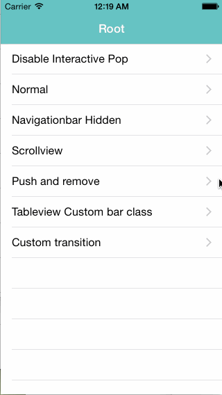

# RTRootNavigationController

[](https://travis-ci.org/rickytan/RTRootNavigationController)
[](http://cocoapods.org/pods/RTRootNavigationController)
[](http://cocoapods.org/pods/RTRootNavigationController)
[](http://cocoapods.org/pods/RTRootNavigationController)

## Introduction
More and more apps use custom navigation bar for each different view controller, instead of one common, gloabal navigation bar.

This project just help develops to solve this problem in a tricky way, develops use this navigation controller in a farmilar way just like you used to be, and
you can have each view controller a individual navigation bar.

越来越多的应用为每一个 **VC** 设置单独的导航条，而不是之前那样使用一个全局统一的导航条，因为不同的 **VC** 有不同的视觉样式，前一个是蓝色的，后一个也许要做成红色、透明，或者干脆没有导航条。

虽然开发者可以在每个 **VC** 的 `- (void)viewWillAppear` （想想为什么不是 `- (void)viewDidLoad`） 方法中设置自己所需的样式，但是在同一个导航条上来回修改，稍不注意就会导致样式混乱。另一种实现方式，是隐藏全局那个导航条，每个 **VC** 自己通过 `addSubview:(UIView *)view` 的方式自己设置导航条。这种实现是可行的，但是使用不方便了，如：
- 无法使用 `self.navigationItem.rightBarButtonItem` 等来设置导航按钮，而必须自己手动往 `navigationBar` 上加；
- 无法使用 `self.title` 来修改导航标题，而必须自己添加监听；
- 无法方便地设置 `navigationBarHidden`；
- 无法方便地自动调整 `contentInsets`。

等等。

本项目提供一种透明的方式，让开发者像以前一样使用导航器，同时，每个 `push` 进来的 **VC** 有自己独立的导航条。

## Feature

* Custom navigation bar class support
* Unwind support
* Rotation support
* Interactive pop enable and disable support
* `Interface Builder` support

* 每个 **VC** 支持自定义的 `navigationBarClass`
* 支持 `unwind`（不知道什么是 `unwind`？请参考：[这里](https://developer.apple.com/library/ios/technotes/tn2298/_index.html)）
* 支持转屏
* 支持禁用交互式返回
* 支持 `Interface Builder`





## Usage

As an advise, please set `RTRootNavigationController` as your rootViewController:

```objective-c
- (BOOL)application:(UIApplication *)application didFinishLaunchingWithOptions:(NSDictionary *)launchOptions
{

    UIViewController *yourController = ...;
    self.window.rootViewController = [[RTRootNavigationController alloc] initWithRootViewController:yourController];
    return YES;
}
```

To run the example project, clone the repo, and run `pod install` from the Example directory first.

## Requirements

* **iOS 7** and up
* **Xcode 7** and up

## Installation

RTRootNavigationController is available through [CocoaPods](http://cocoapods.org). To install
it, simply add the following line to your Podfile:

```ruby
pod "RTRootNavigationController"
```

## Author

rickytan, ricky.tan.xin@gmail.com

## License

RTRootNavigationController is available under the MIT license. See the LICENSE file for more info.
